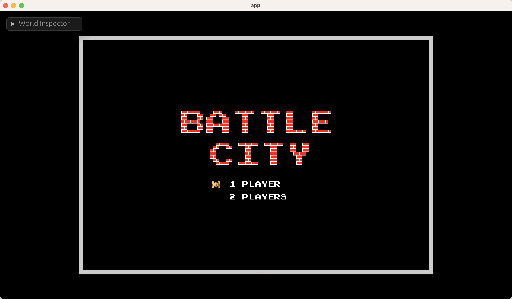
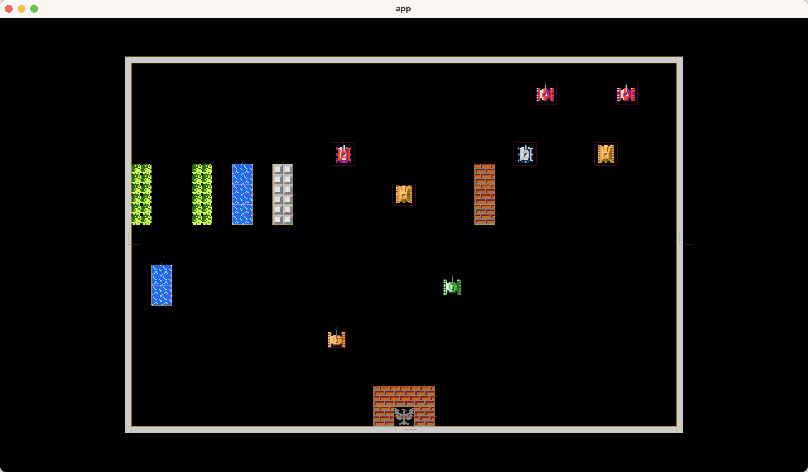
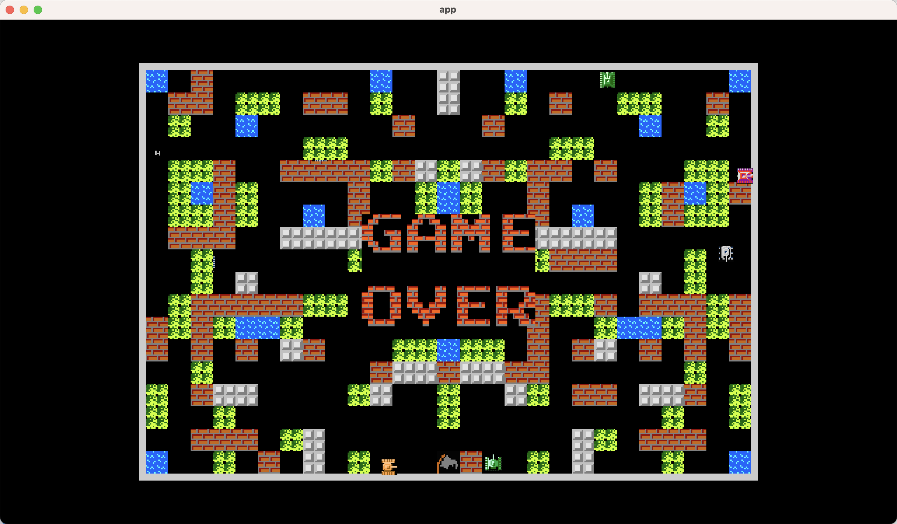

[English](README_EN.md)

# battle-city 坦克大战游戏
- [x] LDTK软件编辑关卡
- [x] 关卡载入
- [x] 关卡切换
- [x] 玩家定点和敌人随机点出生
- [x] 利用物理引擎进行碰撞检测
- [x] 玩家出生、护盾、爆炸、水波等精灵动画
- [x] 游戏UI
- [x] 游戏音效
- [x] 暂停游戏
- [x] 敌人AI实现
- [x] 本地多人模式
- [x] WASM支持

在线游玩：[点这里](https://nightswatchgames.github.io/games/battle-city/)（电脑版Chrome/Firefox/Edge打开）

## 运行
1. 本地运行
```
cargo run
```
2. WASM运行
```
rustup target install wasm32-unknown-unknown
cargo install wasm-server-runner
cargo run --target wasm32-unknown-unknown
```
```
cargo install wasm-bindgen-cli
cargo build --release --target wasm32-unknown-unknown
wasm-bindgen --out-dir ./out/ --target web ./target/wasm32-unknown-unknown/release/battle-city.wasm
```

## 游戏展示
视频演示：[B站](https://www.bilibili.com/video/BV1fx4y1w7RC/)





## 参考资料
- [bevy-cheatbook](https://github.com/bevy-cheatbook/bevy-cheatbook)（[中文翻译](https://yiviv.com/bevy-cheatbook/)）
- [Unity制作坦克大战](https://www.bilibili.com/video/BV1PW41197Su)
- [Battle City - Wikipedia](https://en.wikipedia.org/wiki/Battle_City)

## 问题
**1.2d游戏角色改变方向时，通常是切换sprite还是进行sprite旋转？**

**2.Sprite Sheet 和 Texture Atlas 理解和区别？**
Texture Atlas 是指一张大图片（图集）包含多个texture，Sprite Sheet 通常是指一张大图片包含帧动画的每一帧（texture），实质上跟 Texture Atlas 一样。在 Bevy 0.10 中，帧动画（SpriteSheetBundle）也是直接使用 struct TextureAtlas 存储图集，并没有使用单独的 struct SpriteSheet 存储。
- https://forum.unity.com/threads/sprite-atlas-vs-manual-sprite-sheet.1229424/
- https://gamedev.stackexchange.com/questions/69895/what-is-the-difference-between-a-sprite-sheet-and-a-texture-atlas
- https://docs.rs/bevy/latest/bevy/sprite/struct.TextureAtlas.html
- https://docs.rs/bevy/latest/bevy/sprite/struct.SpriteSheetBundle.html